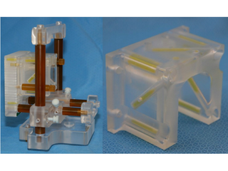

# Intra-procedural tracking of targets

Intra-procedural phase of the workflow is driven by the intra-procedural image data. The sequence of processing steps and the corresponding types of image series is the following:
1. Z-frame calibration: in this step, z-frame device attached to the transperineal biopsy template is registered with the coordinate frame of the scanner.
2. Registration of the pre-procedural T2-weighted series to the intra-procedural imaging and re-identification of the planned target locations.
3. Tracking of the biopsy targets in the needle confirmation scans and visualization of the needle path.

## Z-frame calibration

Z-frame is a calibration device that consists of a plastic enclosure that attaches rigidly to the template assembly, and  8 elongated capsules containing liquid that gives bright signal in certain types of MR images. 

Given the known configuration of these capsules and their appearance in the image, it is possible to align the known configuration with the corresponding image artifacts, and thus establish a transformation between the biopsy template and the scanner coordinate system.

|  | 1:0 |
| -- | -- |
| 0:2 | 1:2 |
