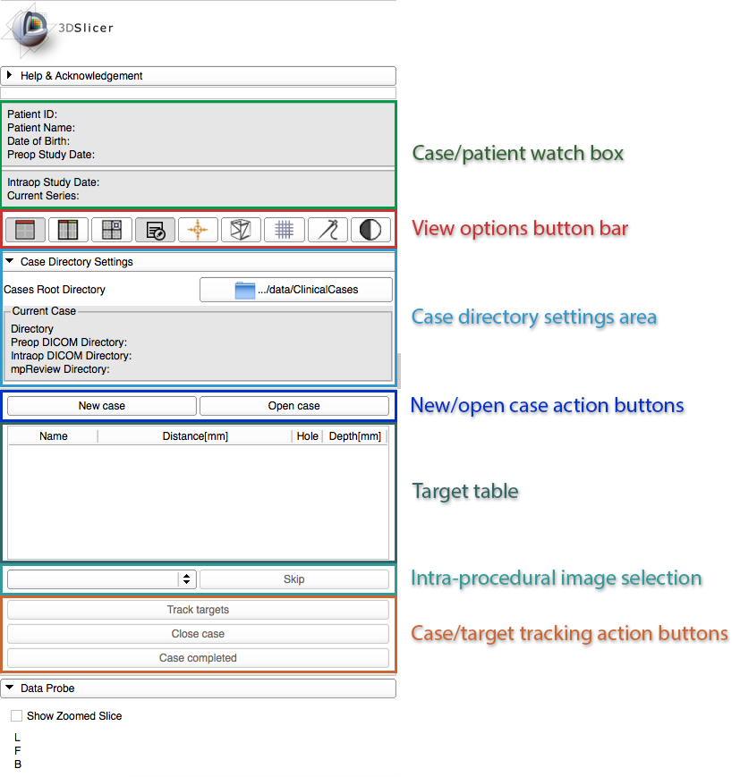
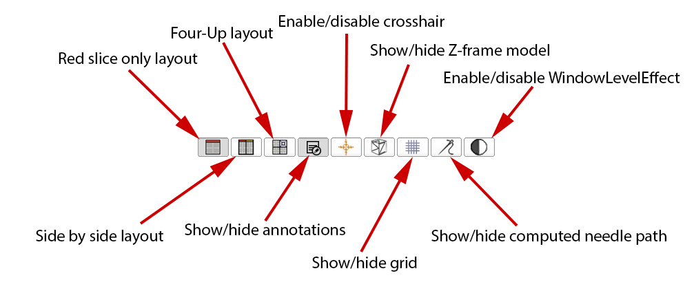
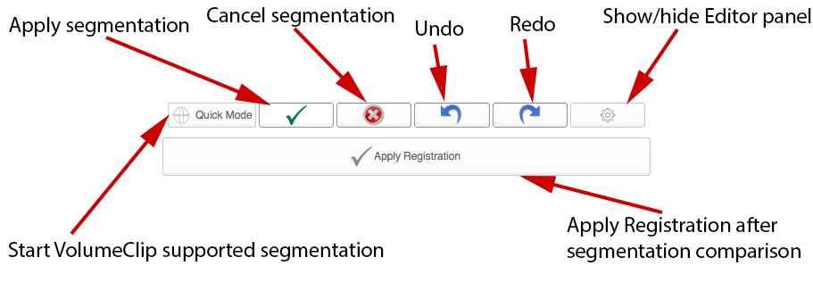
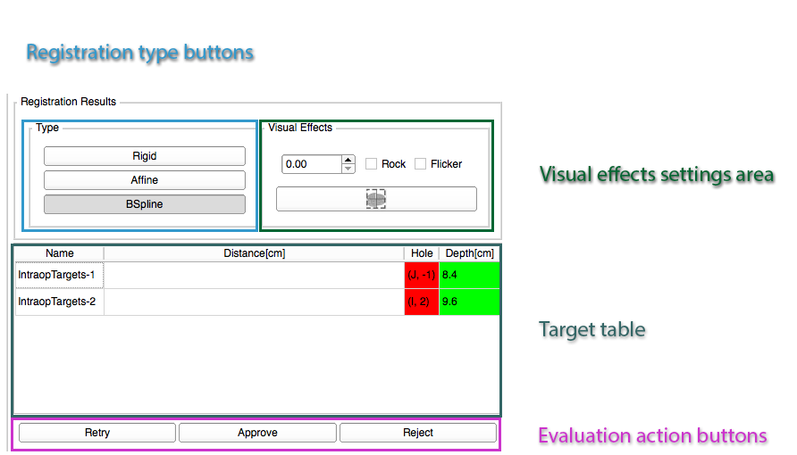

# User Interface Description

## Overview
The overview mode allows user to create/load cases, trigger target tracking and view already processed registration results. It's the main step which is displayed after loading SliceTracker.

| User Interface Element | Description |
| -- | -- |
| Case/patient watch box | Displays information about the current patient, pre-procedural and current study |
| View options bar | Provides buttons for controlling the visibility of annotations, crosshair, Z-frame model, grid and computed needle path model. All supported layouts are available through buttons and additional to that the `WindowLevelEffect` for changing the window level with respect to fore -and background is included.  |
| Case directory settings area | This area includes a directory selector which represents the root directory for all cases. Furthermore when starting/loading a case, all directory information to that case are displayed in the directory watch box below the `Cases Root Directory` directory selector. |
| New/open case action buttons | Action buttons for creating a new case or loading/continuing an existing case. |
| Target table | Once a case has been loaded and pre-procedural data has been processed, all set targets will be listed in that table. Additional to that, information about cursor distance, grid hole and depth for needle insertion are computed. |
| Intra-procedural image selection | As soon as intra-procedural images are received and loaded, they will appear in that selector. Colors indicate the availability of registration results. Images can only be skipped in specific circumstances. `Cover Prostate` and `Cover Template` images cannot be skipped since they are essential for the whole process of doing registration. |
| Case/target tracking action buttons | Divided into three buttons this area allows the user to initiate the tracking of targets, closing a case (can be continued) or complete a case (can only be opened in readonly) |

## Segmentation
For initiating target tracking a segmentation mask needs to be created which covers the area of the prostate. The image below describes the user interface elements of that step.

## Registration evaluation 
| User Interface Element | Description |
| -- | -- |
| Registration type buttons | |
| Visual effects settings area| |
| | |

